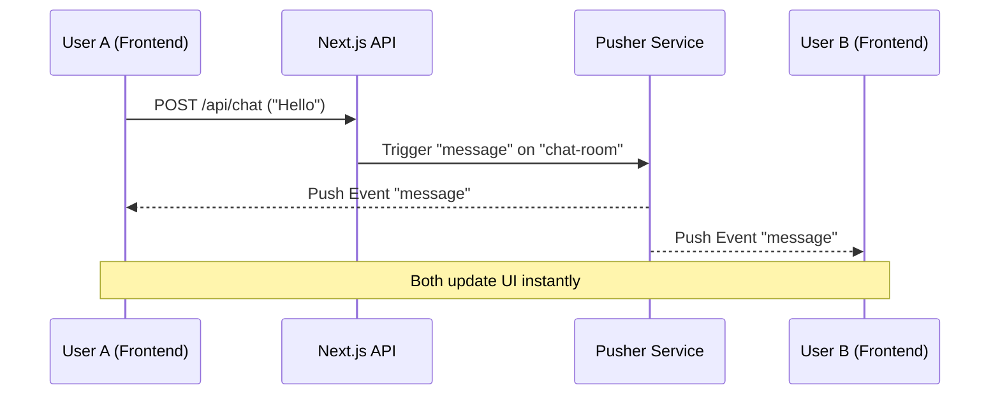

# AI Chat & Search Application

This is a Next.js application that combines AI-powered search with a real-time chat room. It features a modern, glassmorphic UI and robust Markdown rendering.

## Features

-   **AI Search**: Ask questions and get AI-generated answers with rich Markdown formatting (tables, code blocks, lists).
-   **Real-time Chat**: A group chat room powered by Pusher for instant messaging.
-   **Modern UI**: Glassmorphism effects, smooth animations, and a responsive design.
-   **Secure**: Server-side API routes for handling API keys.

## Getting Started

First, run the development server:

```bash
npm run dev
```

Open [http://localhost:3000](http://localhost:3000) with your browser to see the result.

## How It Works (Pusher Workflow)

Here is the step-by-step flow of a message in our chatroom:

1.  **User A Sends Message**:
    -   User A types "Hello" and hits Enter.
    -   The frontend (`app/chat/page.tsx`) sends a `POST` request to our API (`/api/chat`).

2.  **Server Triggers Event**:
    -   The API route (`app/api/chat/route.ts`) receives the message.
    -   It uses the `pusher` server library to **trigger** an event named `"message"` on the channel `"chat-room"`.
    -   Payload: `{ username: "User A", message: "Hello", timestamp: "..." }`

3.  **Pusher Distributes**:
    -   Pusher receives this event from our server.
    -   It instantly pushes this data to **all** clients (User A, User B, User C) who are currently **subscribed** to the `"chat-room"` channel.

4.  **Clients Receive**:
    -   The frontend (`app/chat/page.tsx`) has a listener active: `channel.bind("message", ...)`.
    -   When the event arrives, the callback runs, adding the new message to the `messages` state array.
    -   React re-renders the component, showing the new message to everyone simultaneously.



## Environment Setup

Create a `.env.local` file in the root directory with the following keys:

```env
# Pusher (Get these from your Pusher Dashboard)
PUSHER_APP_ID="your_app_id"
PUSHER_KEY="your_key"
PUSHER_SECRET="your_secret"
PUSHER_CLUSTER="your_cluster"

NEXT_PUBLIC_PUSHER_KEY="your_key"
NEXT_PUBLIC_PUSHER_CLUSTER="your_cluster"

# OpenRouter AI
OPENROUTER_API_KEY="your_openrouter_key"
```
